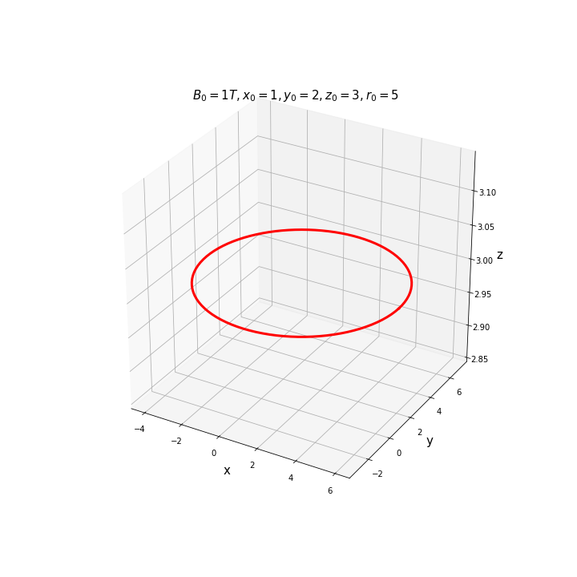
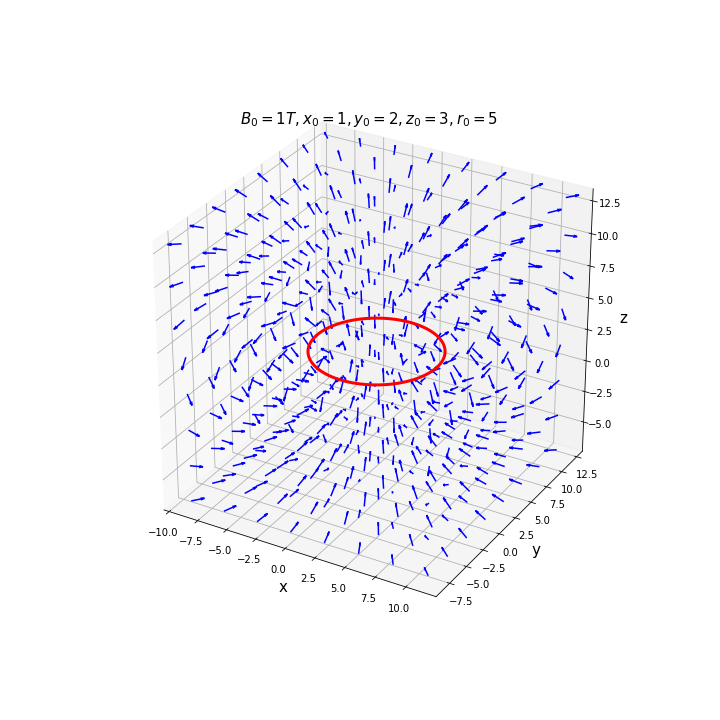
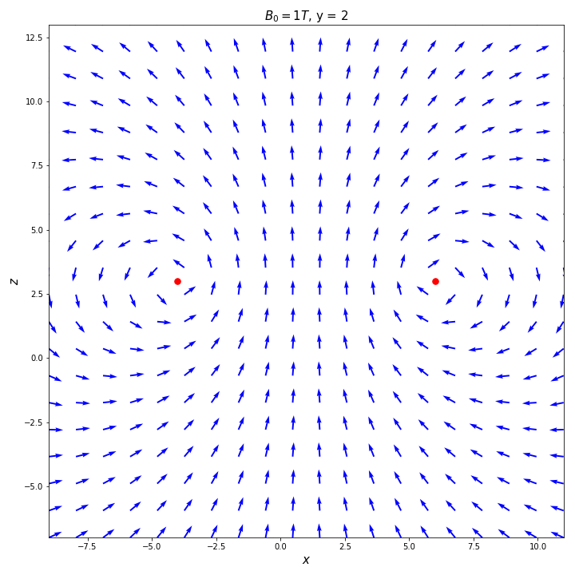

# solenoid.py
To simulate solenoids and compute the magnetic field

## Class Tile.py
### Tile (constructor)
To create the tile

* Arguments
     - B0: float — magnetic field at the center of the tile
     - x0: float — the x position of the tile
     - y0: float — the y position of the tile
     - z0: float — the z position of the tile
     - r0: float — the radius of the tile
* Example

```python
tile = Tile(1,1,2,3,5) 
```

### Tile.field
To compute the magnetic field produced by the tile

* Arguments
     - x: float — the x coordinate
     - y: float — the y coordinate
     - z: float — the y coordinate

* Returns
     - Bx, By, Bz: (float,float,float) — The magnetic field

* Example
     
```python
tile = Tile(1,1,2,3,5)
l = np.linspace(-1,1,10)
x, y, z = np.meshgrid(l,l,l)
Bx, By, Bz = tile.field(l,l,l)
```

### Tile.displayTile
To display the tile

* Arguments
     - figsize: (float,float) — to determine the size of the figure
     - color: string — color of the tile
     - linewidth: float — thickness of the tile
* Returns
     - fig: matplotlib.pyplot.figure — the figure

* Example

```python
tile = Tile(1,1,2,3,5)
fig = tile.displayTile()
fig.savefig("tile.png")
```


### Tile.displayField3D(figsize=(10,10),nb_points=8,colorTile="red",colorArrow="blue",linewidth=3)
To display the field

* Arguments
     - figsize: (float,float) — to determine the size of the figure
     - nb_points: int — number of points of evaluation on each axis
     - colorTile: string — color of the tile
     - colorArrow: string — color of the arrows
     - linewidth: float — thickness of the tile

* Returns
     - fig: matplotlib.pyplot.figure — the figure

* Example
     
```python
tile = Tile(1,1,2,3,5)
fig = tile.displayField3D()
fig.savefig("3D.png")
```



### Tile.displayField2D

To display the field in a plan x=0, y=0 or z=0

* Arguments
     - eq_0: string — to define the variable equal to 0, accepted argument "x", "y"
     - figsize: (float,float) — to determine the size of the figure
     - nb_points: int — number of points of evaluation on each axis
     - color: string — color of the arrows
     - markTile: boolean — To diplay the position of the tile
* Returns
     - fig: matplotlib.pyplot.figure — the figure

* Example
     
```python
tile = Tile(1,1,2,3,5)
fig = tile.displayField2D()
fig.savefig("2D.png")
```

## Class Solenoid.py

