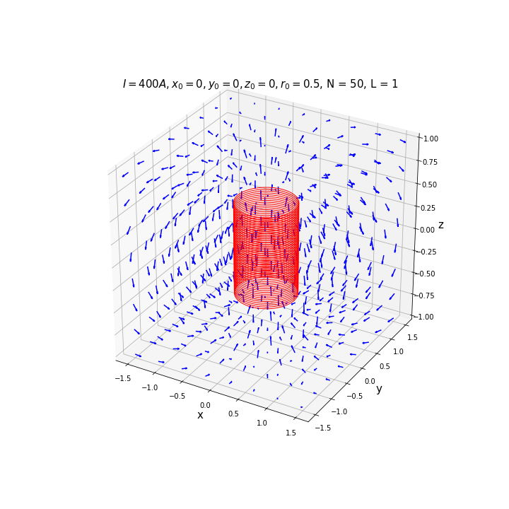

# solenoid.py
To simulate solenoids and compute the magnetic field

## Class Tile.py
To simulate the tile

* Attributes
    - self.B0: float — magnetic field at the center of the tile
    - self.x0: float — the x position of the tile
    - self.y0: float — the y position of the tile
    - self.z0: float — the z position of the tile
    - self.r0: float — the radius of the tile
    
### Tile (constructor)
To create the tile

* Arguments
     - B0: float — magnetic field at the center of the tile
     - x0: float — the x position of the tile
     - y0: float — the y position of the tile
     - z0: float — the z position of the tile
     - r0: float — the radius of the tile
* Example

```python
tile = Tile(1,1,2,3,5)
```

### Tile.field
To compute the magnetic field produced by the tile. 

Be careful, you cannot estimate the field on the tile. In that cas, the field value is ```nan```.

* Arguments
     - x: float — the x coordinate
     - y: float — the y coordinate
     - z: float — the y coordinate

* Returns
     - Bx, By, Bz: (float,float,float) — The magnetic field

* Example

```python
tile = Tile(1,1,2,3,5)
l = np.linspace(-1,1,10)
x, y, z = np.meshgrid(l,l,l)
Bx, By, Bz = tile.field(l,l,l)
```

### Tile.displayTile
To display the tile

* Arguments
     - figsize: (float,float) — to determine the size of the figure
     - color: string — color of the tile
     - linewidth: float — thickness of the tile
* Returns
     - fig: matplotlib.pyplot.figure — the figure

* Example

```python
tile = Tile(1,1,2,3,5)
fig = tile.displayTile()
fig.savefig("tile.png")
```


### Tile.displayField3D()
To display the field

* Arguments
     - figsize: (float,float) — to determine the size of the figure
     - nb_points: int — number of points of evaluation on each axis
     - colorTile: string — color of the tile
     - colorArrow: string — color of the arrows
     - linewidth: float — thickness of the tile

* Returns
     - fig: matplotlib.pyplot.figure — the figure

* Example

```python
tile = Tile(1,1,2,3,5)
fig = tile.displayField3D()
fig.savefig("3D.png")
```


### Tile.displayField2D
To display the field in a plan x=0, y=0 or z=0

* Arguments
     - eq_0: string — to define the variable equal to 0, accepted argument "x", "y"
     - figsize: (float,float) — to determine the size of the figure
     - nb_points: int — number of points of evaluation on each axis
     - color: string — color of the arrows
     - markTile: boolean — To diplay the position of the tile
* Returns
     - fig: matplotlib.pyplot.figure — the figure

* Example

```python
tile = Tile(1,1,2,3,5)
fig = tile.displayField2D()
fig.savefig("2D.png")
```


## Class Solenoid.py
To simulate a solenoid

* Attributes
    - self.B0: float
        magnetic field at the center of the tile
    - self.L: float
        the length of the solenoid in meter
    - self.n: float
        number of tiles per meter
    - self.x0: float
        the x position of the tile
    - self.y0: float
        the y position of the tile
    - self.z0: float
        the z position of the tile
    - self.r0: float
        the radius of the tile
    - self.axis: string (for now, the only acceptable value is "z")
        the axis of the solenoid
    - self.N: int(n*L)
        number of tiles
        
### Solenoid (constructor)
* Arguments
    - B0: float — magnetic field at the center of the tile
    - L: float — the length of the solenoid in meter
    - n: float — number of tiles per meter
    - x0: float — the x position of the tile
    - y0: float — the y position of the tile
    - z0: float — the z position of the tile
    - r0: float — the radius of the tile
    - axis: string — the axis of the solenoid

* Example
   
```python
sol = Solenoid(B0=1,L=1,n=100,x0=0,y0=0,z0=0,r0=0.5,axis="z")
print(sol)
```
    
### Solenoid.field
To compute the magnetic field produced by the solenoid

* Arguments
    - x: float
        the x coordinate
    - y: float
        the y coordinate
    - z: float
        the y coordinate

* Returns
    - Bx, By, Bz: (float,float,float)
        The magnetic field

* Example

```python
sol = solenoid(r0=0.5)
l = np.linspace(-1,1,10)
x, y, z = np.meshgrid(l,l,l)
Bx, By, Bz = sol.field(l,l,l)
```
            
### Solenoid.displaySolenoid
To display the solenoid

* Arguments
    - figsize: (float,float)
        to determine the size of the figure
    - color: string
        color of the tile
    - linewidth: float
        thickness of the tile
* Returns
    - fig: matplotlib.pyplot.figure
        the figure
        
* Example

```python
sol = Solenoid()
fig = sol.displaySolenoid()
fig.savefig("sol.png")
```


### Solenoid.displayField3D


### Solenoid.displayField2D

