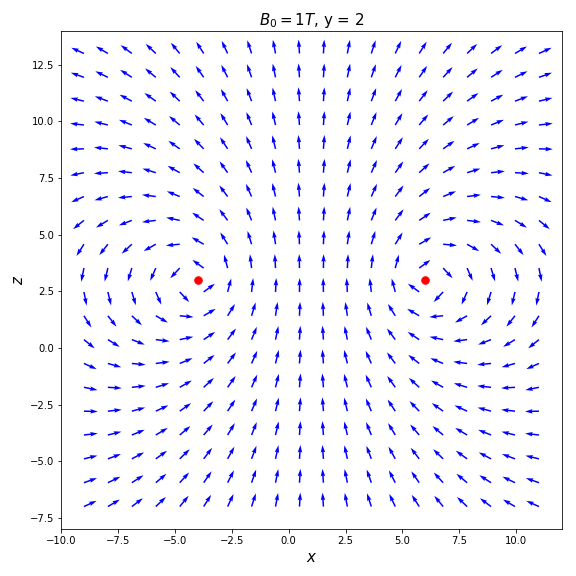
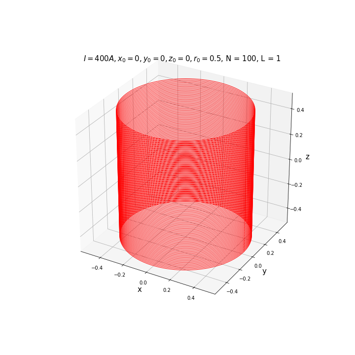
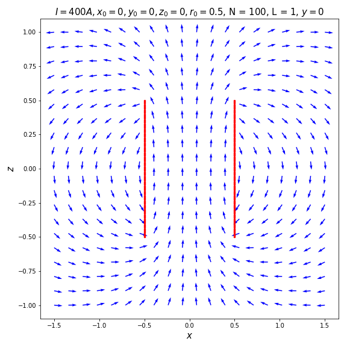

# solenoid.py
To simulate solenoids and compute the magnetic field

## Class Loop.py
To simulate the loop

* Attributes
    - self.B0: float — magnetic field at the center of the loop
    - self.x0: float — the x position of the loop
    - self.y0: float — the y position of the loop
    - self.z0: float — the z position of the loop
    - self.r0: float — the radius of the loop
    
### Loop (constructor)
To create the loop

* Arguments
     - B0: float — magnetic field at the center of the loop
     - x0: float — the x position of the loop
     - y0: float — the y position of the loop
     - z0: float — the z position of the loop
     - r0: float — the radius of the loop
* Example

```python
loop = Loop(1,1,2,3,5)
```

### Loop.field
To compute the magnetic field produced by the loop. 

Be careful, you cannot estimate the field on the loop. In that cas, the field value is ```nan```.

* Arguments
     - x: float — the x coordinate
     - y: float — the y coordinate
     - z: float — the y coordinate

* Returns
     - Bx, By, Bz: (float,float,float) — The magnetic field

* Example

```python
import numpy as np

loop = Loop(1,1,2,3,5)
l = np.linspace(-1,1,10)
x, y, z = np.meshgrid(l,l,l)
Bx, By, Bz = loop.field(x, y, z)
```

### Loop.exportFieldMap
To export a field map as a .txt file

* Arguments
    - filename: String — the name of the output file
    - xmin: float — the x min coordinate
    - xmax: float — the x max coordinate
    - ymin: float — the y min coordinate
    - ymax: float — the y max coordinate
    - zmin: float — the z min coordinate
    - zmax: float — the z max coordinate
    - nb_points: int — number of points of evaluation on each axis
    
* Example

```python
loop = Loop()
loop.exportFieldMap("output_map.txt",-1,1,-1,1,-1,1,20)
```  

### Loop.exportField
To export the field computed in some points as a .txt file

* Arguments
    - filename: String — the name of the output file
    - x: 1D np.array(float) — the x coordinates
    - y: 1D np.array(float) — the y coordinates
    - z: 1D np.array(float) — the z coordinates
    
* Example

```python
import numpy as np

z = np.linspace(-2,2,20)
x = np.zeros_like(z)
y = np.zeros_like(z)
loop = Loop()
loop.exportField("output.txt",x,y,z)
```

### Loop.plotFieldMainAxis
To plot the field on the main axis

* Arguments
    - zmin: float — the z min coordinate
    - zmax: float — the z max coordinate
    - nbpoints: int — number of points of evaluation
    - figsize: (float,float) — the size of the figure
        
* Returns
    - fig: matplotlib.pyplot.figure — the figure
        
* Example

```python
loop = Loop(B0=0.1)
fig = loop.plotFieldMainAxis(zmin=-5,zmax=5)
fig.savefig("axis_loop.png")
```


### Loop.displayLoop
To display the loop

* Arguments
     - figsize: (float,float) — to determine the size of the figure
     - color: string — color of the loop
     - linewidth: float — thickness of the loop
* Returns
     - fig: matplotlib.pyplot.figure — the figure

* Example

```python
loop = Loop(1,1,2,3,5)
fig = loop.displayLoop()
fig.savefig("loop.png")
```


### Loop.displayField3D()
To display the field

* Arguments
     - figsize: (float,float) — to determine the size of the figure
     - nb_points: int — number of points of evaluation on each axis
     - colorLoop: string — color of the loop
     - colorArrow: string — color of the arrows
     - linewidth: float — thickness of the loop

* Returns
     - fig: matplotlib.pyplot.figure — the figure

* Example

```python
loop = Loop(1,1,2,3,5)
fig = loop.displayField3D()
fig.savefig("3D.png")
```


### Loop.displayField2D
To display the field in a plan x=0, y=0 or z=0

* Arguments
     - eq_0: string — to define the variable equal to 0, accepted argument "x", "y"
     - figsize: (float,float) — to determine the size of the figure
     - nb_points: int — number of points of evaluation on each axis
     - color: string — color of the arrows
     - markLoop: boolean — To diplay the position of the loop
* Returns
     - fig: matplotlib.pyplot.figure — the figure

* Example

```python
loop = Loop(1,1,2,3,5)
fig = loop.displayField2D()
fig.savefig("2D.png")
```


## Class Solenoid.py
To simulate a solenoid

* Attributes
    - I: float — the current intensity
    - self.B0: float — magnetic field inside the solenoid if it were infinite
    - self.L: float — the length of the solenoid in meter
    - self.n: float — number of loops per meter
    - self.x0: float — the x position of the loop
    - self.y0: float — the y position of the loop
    - self.z0: float — the z position of the loop
    - self.r0: float — the radius of the loop
    - self.axis: string — the axis of the solenoid
    - self.N: int(n*L) — number of loops
    - self.loops: array(Loop) — the loops
        
### Solenoid (constructor)
The constructor

* Arguments
    - I: float — the current intensity
    - L: float — the length of the solenoid in meter
    - n: float — number of loops per meter
    - x0: float — the x position of the loop
    - y0: float — the y position of the loop
    - z0: float — the z position of the loop
    - r0: float — the radius of the loop
    - axis: string (for now, the only acceptable value is "z") — the axis of the solenoid

* Example

```python
sol = Solenoid(I=400,L=1,n=100,x0=0,y0=0,z0=0,r0=0.5,axis="z")
print(sol)
```
    
### Solenoid.field
To compute the magnetic field produced by the solenoid

* Arguments
    - x: float — the x coordinate
    - y: float — the y coordinate
    - z: float — the y coordinate

* Returns
    - Bx, By, Bz: (float,float,float) — The magnetic field

* Example

```python
import numpy as np

sol = Solenoid(r0=0.5)
l = np.linspace(-1,1,10)
x, y, z = np.meshgrid(l,l,l)
Bx, By, Bz = sol.field(x, y, z)
```

### Solenoid.exportFieldMap
To export a field map as a .txt file

* Arguments
    - filename: String — the name of the output file
    - xmin: float — the x min coordinate
    - xmax: float — the x max coordinate
    - ymin: float — the y min coordinate
    - ymax: float — the y max coordinate
    - zmin: float — the z min coordinate
    - zmax: float — the z max coordinate
    - nb_points: int — number of points of evaluation on each axis
    
* Example

```python
sol = Solenoid(n=50)
sol = exportFieldMap("output_map.txt",-1,1,-1,1,-1,1,20)
```  

### Solenoid.exportField
To export the field computed in some points as a .txt file

* Arguments
    - filename: String — the name of the output file
    - x: 1D np.array(float) — the x coordinates
    - y: 1D np.array(float) — the y coordinates
    - z: 1D np.array(float) — the z coordinates
    
* Example

```python
import numpy as np

z = np.linspace(-2,2,20)
x = np.zeros_like(z)
y = np.zeros_like(z)
sol = Solenoid(n=40)
sol.exportField("output.txt",x,y,z)
```

### Solenoid.plotFieldMainAxis
To plot the field on the main axis

* Arguments
    - zmin: float — the z min coordinate
    - zmax: float — the z max coordinate
    - nbpoints: int — number of points of evaluation
    - figsize: (float,float) — the size of the figure
        
* Returns
    - fig: matplotlib.pyplot.figure — the figure
        
* Example

```python
sol = Solenoid(n = 1000, I = 100,L = 5, z0 = 33)
fig = sol.plotFieldMainAxis(zmin=-sol.L,zmax=sol.L)
fig.savefig("axis_sol.png")
```


        
### Solenoid.displaySolenoid
To display the solenoid

* Arguments
    - figsize: (float,float) — to determine the size of the figure
    - color: string — color of the loop
    - linewidth: float — thickness of the loop
* Returns
    - fig: matplotlib.pyplot.figure — the figure
        
* Example

```python
sol = Solenoid()
fig = sol.displaySolenoid()
fig.savefig("sol.png")
```


### Solenoid.displayField3D
To display the field in 3D
* Arguments
    - figsize: (float,float) — to determine the size of the figure
    - nb_points: int — number of points of evaluation on each axis
    - colorLoop: string — color of the loops
    - colorArrow: string — color of the arrows
    - linewidth: float — thickness of the loops
        
* Returns
    - fig: matplotlib.pyplot.figure — the figure
* Example

```python
sol = Solenoid(n = 50)
fig = sol.displayField3D()
fig.savefig("sol_3D.png")
```    


### Solenoid.displayField2D
To display the field in a plan x=0, y=0 or z=0

* Arguments
    - eq_0: string — to define the variable equal to 0 — accepted argument "x", "y"
    - figsize: (float,float) — to determine the size of the figure
    - nb_points: int — number of points of evaluation on each axis
    - color: string — color of the arrows
    - markLoop: boolean — To diplay the position of the loops
    
* Returns
    - fig: matplotlib.pyplot.figure — the figure
        
* Example

```python
sol = Solenoid(n=100)
fig = sol.displayField2D(figsize=(8,8))
fig.savefig("sol_2D.png")
```
            

